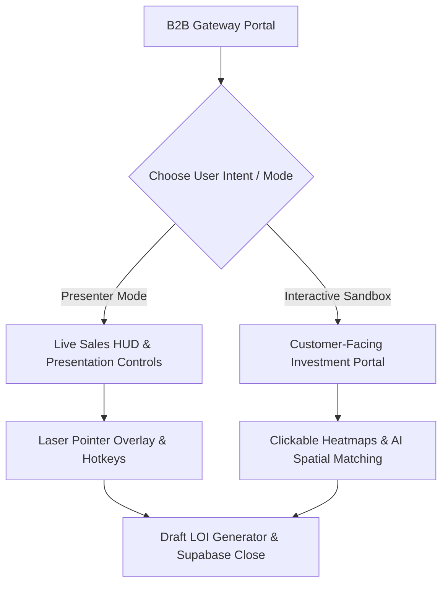

# 🌌 Dubai Mall | B2B Cinematic Interactive Presenter & Commercial Sandbox

[](https://nextjs.org/)
[](https://react.dev/)
[](https://tailwindcss.com/)
[](https://supabase.com/)
[](https://nextjs.org/)

An ultra-luxury, browser-based digital sales asset built to replace fragmented, offline sales materials (PDFs, static slide decks, spreadsheets) with a unified, high-stakes presentation deck and investment simulator. Inspired by Apple and Tesla’s digital showcase assets, this application empowers luxury retail tenants, corporate sponsors, and event promoters to evaluate and secure commercial spaces at the world's most visited retail destination.

---

## 🎯 1. The Core Strategy: Presenter Console vs. B2B Sandbox

To solve the fragmented sales workflow described in the screening assignment, the application is engineered around a **Dual-Mode User Experience Engine**:



### 🎤 Presenter Mode (For Live Sales Calls & Screen Shares)
Tailored for Emaar sales representatives to lead high-stakes video pitches:
* **Presenter HUD Overlay:** A quick-toggle control overlay offering speaker notes, regional pitch cues, and target demographics for the active slide.
* **Keyboard Hotkey Matrix:** Numeric and arrow hotkeys to rapidly skip slides, toggle demographical data overlays, or launch high-definition walkthrough videos without mouse clicks.

### 🏗️ B2B Sandbox Mode (For Independent Prospect Exploration)
Designed for brand CFOs and agency partners evaluating the property on their own:
* **Interactive Footfall Heatmaps:** Prospects click on different mall corridors (e.g. Fashion Avenue, Grand Atrium, Promenade) to view real-time traffic density, demographic segments, and average shopper dwell times.
* **AI-Powered Placement Simulator:** Custom matching algorithms analyze the prospect’s brand category and audience targets, recommending optimal physical locations and generating tailored sales pitches on the fly.
* **Storefront Activation Visualizer:** Shows AI-generated design concepts of flagships and billboards inside Emaar's digital environments to build immediate emotional buy-in.
* **Dynamic Term-Sheet Configurer:** Slider-based financial estimators that estimate monthly exposure value, CPM metrics, and leasing rates based on space constraints and duration.

---

## 🎭 2. Hidden Features & Presenter Superpowers (Developer Easter Eggs)

The application contains several highly optimized, non-obvious engineering features designed to deliver a flawless, high-end pitching experience:

### ⚡ GPU-Accelerated Virtual Laser Pointer
* **How it works:** Toggle **Presenter Mode** (`P` key) to activate a red glowing laser pointer for screen sharing.
* **Under the Hood:** Rather than updating React state coordinates on mouse movements (which triggers Virtual DOM updates and causes trailing input lag), the laser tracks the cursor using a React `useRef` directly writing `translate3d` coordinates to the DOM's style layer. The layer has styling hooks with `will-change-transform` to force GPU compositing, keeping the tracking lag-free at the browser's native refresh rate.

### ⌨️ Presenter Keybindings Matrix (Zero-Click Navigation)
* **`P`**: Toggle Presenter Mode on/off.
* **`H`**: Toggle Speaker Notes HUD card.
* **`1` to `9`**: Jump instantly to slides 1 to 9 (Overview to Venue Showcase).
* **`0`**: Jump instantly to slide 10 (Inquiry Registry / Commercial LOI Attestation).
* **`Left / Right Arrows`**: Move slides back and forth smoothly.
* *Note: Key listeners automatically disable themselves when typing inside text inputs, textareas, or drop-down selects to prevent navigation interruptions.*

### 🛡️ Smart State Preservation Context
* **How it works:** Unlike standard multi-page sites where navigation resets inputs, the entire application synchronizes its state globally.
* **Under the Hood:** A global `DeckContext` provider binds the brand profiler, selected corridors, slider estimates, and LOI attestation together. If a prospect selects "Fashion Avenue Ground Floor" on the Sandbox slide, that data persists to compile and sign their custom B2B Letter of Intent on the final slide.

### 🧭 Smart Path Redirect Fallbacks
* **How it works:** Standard slide decks fail when a user accesses internal slide paths directly.
* **Under the Hood:** Next.js pages (e.g., `/leasing`, `/events`, `/overview`) act as route intercepts. When loaded directly, they run a silent client-side replace redirect pointing the user to the main canvas with the respective anchor hash (`/#leasing`, `/#venues`), mounting the correct slide context smoothly.

---

## 🎨 3. Design System & Aesthetics (Apple/Tesla Minimalist Luxury)

Following premium design directions, the application rejects heavy dark themes or high-contrast neumorphic shadows in favor of a clean, light-mode design system:
* **Luxury Slate Canvas:** A light slate-gray canvas (`#F8FAFC`) gives elements adequate room to breathe.
* **Minimalist Glass Surfaces:** Cards and panels are rendered as clean, flat white glass cards with hairline borders (`rgba(0, 0, 0, 0.05)`) and ultra-subtle ambient drop shadows.
* **Cinematic Video Integration:** Autoplay background video loops with custom radial glass vignettes to keep overlay typography readable.
* **High-Contrast Typography:** Modern typography grids using editorial fonts deliver a premium presentation feel.

---

## 🛠️ 4. Technical Stack & Architecture

* **Framework:** Next.js `16.2.7` App Router (utilizing Turbopack and React Compiler).
* **Frontend:** React `19.2.4` & TypeScript `5.x`.
* **Styling:** Tailwind CSS `v4` (utilizing `@theme` configuration directives).
* **Animation:** Framer Motion (scroll-triggered fades, section staggers, physics-based slide sweeps).
* **Database Connection:** Supabase Client (direct client insertion mapping for inquiry entries).
* **Icons:** React Icons.

---

## 📂 5. Modular Directory Structure

```
src/
├── app/
│   ├── layout.tsx         # Google Fonts, high-res Favicon metadata, and OG tags
│   ├── page.tsx           # Interactive deck mount node
│   ├── globals.css        # Tailwind directives and custom luxury styles
│   └── [redirects]/       # Client-side page redirects pointing to active slide hashes
├── components/
│   ├── deck/
│   │   └── InteractiveDeck.tsx # Presentation engine and state machine
│   ├── navigation/
│   │   └── LeftSidebar.tsx     # Desktop sidebar and mobile navigation drawer
│   ├── shared/
│   │   └── VideoBackground.tsx # High-definition cinematic fallback media
│   └── [feature]/         # Modular page-specific showcase components
├── data/
│   └── [feature]Data.ts   # Decoupled commercial metrics, pricing guides, and specifications
└── lib/
│   ├── utils.ts           # Tailwind ClassName merge utility
│   └── supabase.ts        # Database client initialization node
└── hooks/
    └── useIntersectionObserver.ts # Optimized viewport threshold listener
```

---

## 🚀 6. Quick-Start Setup Guide

Follow these steps to run the interactive sales deck locally:

### 1. Install Dependencies:
```bash
npm install
```

### 2. Configure Database (Optional):
Create a `.env.local` file in the root directory. If left empty, the application uses mock fallback handlers:
```env
NEXT_PUBLIC_SUPABASE_URL=your_supabase_project_url
NEXT_PUBLIC_SUPABASE_PUBLISHABLE_KEY=your_supabase_anon_publishable_key
```

### 3. Spin Up Development Server:
```bash
npm run dev
```
Open [http://localhost:3000](http://localhost:3000) inside your web browser.

### 4. Verify Production Compilation & Linting:
```bash
npm run lint
npm run build
```

