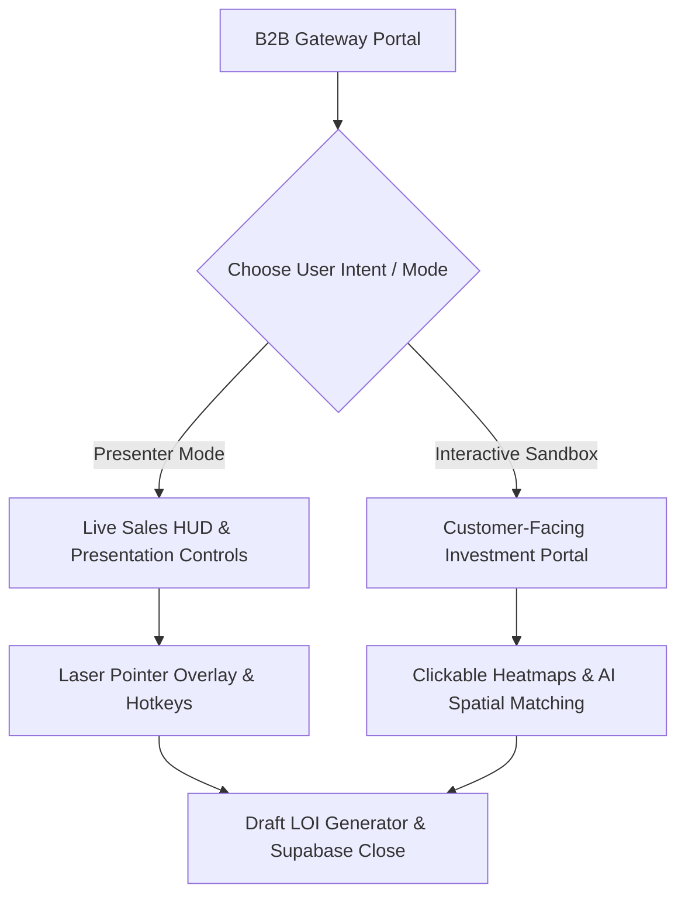

# Dubai Mall | B2B Cinematic Interactive Presenter & Commercial Sandbox

[](https://nextjs.org/)
[](https://react.dev/)
[](https://tailwindcss.com/)
[](https://supabase.com/)
[](https://nextjs.org/)

An ultra-luxury, browser-based digital sales asset built to replace fragmented, offline sales materials (PDFs, static slide decks, spreadsheets) with a unified, high-stakes presentation deck and investment simulator. Inspired by Apple and Tesla’s digital showcase assets, this application empowers luxury retail tenants, corporate sponsors, and event promoters to evaluate and secure commercial spaces at the world's most visited retail destination.

---

## 🎯 1. The Core Strategy: Presenter Console vs. B2B Sandbox

To solve the fragmented sales workflow described in the screening assignment, the application is engineered around a **Dual-Mode User Experience Engine**:



### 🎤 Presenter Mode (For Live Sales Calls & Screen Shares)
Tailored for Emaar sales representatives to lead high-stakes video pitches:
* **Presenter HUD Overlay:** A quick-toggle control overlay offering speaker notes, regional pitch cues, and target demographics for the active slide.
* **Interactive Markup Layer:** A virtual laser pointer allowing the presenter to draw highlights directly on spatial layout plans.
* **Keyboard Hotkey Matrix:** Numeric and arrow hotkeys to rapidly skip slides, toggle demographical data overlays, or launch high-definition walkthrough videos without mouse clicks.

### 🏗️ B2B Sandbox Mode (For Independent Prospect Exploration)
Designed for brand CFOs and agency partners evaluating the property on their own:
* **Interactive Footfall Heatmaps:** Prospects click on different mall corridors (e.g. Fashion Avenue, Grand Atrium, Promenade) to view real-time traffic density, demographic segments, and average shopper dwell times.
* **AI-Powered Placement Simulator:** Custom matching algorithms analyze the prospect’s brand category and audience targets, recommending optimal physical locations and generating tailored sales pitches on the fly.
* **Storefront Activation Visualizer:** Shows AI-generated design concepts of flagships and billboards inside Emaar's digital environments to build immediate emotional buy-in.
* **Dynamic Term-Sheet Configurer:** Slider-based financial estimators that estimate monthly exposure value, CPM metrics, and leasing rates based on space constraints and duration.

### ✍️ The "Close-the-Deal" Letter of Intent (LOI) Funnel
Rather than ending with a static contact form, the final slide generates a **dynamic B2B Letter of Intent (LOI)**. The document automatically summarizes the user’s selected retail format, preferred corridor, requested square footage, and budget parameters. Submitting the LOI writes directly to the Supabase commercial registry, alerting the leasing team with qualified lead parameters.

---

## 🎨 2. Design System & Aesthetics (Apple/Tesla Minimalist Luxury)

Following premium design directions, the application rejects heavy dark themes or high-contrast neumorphic shadows in favor of a clean, light-mode design system:
* **Luxury Slate Canvas:** A light slate-gray canvas (`#F8FAFC`) gives elements adequate room to breathe.
* **Minimalist Glass Surfaces:** Cards and panels are rendered as clean, flat white glass cards with hairline borders (`rgba(0, 0, 0, 0.05)`) and ultra-subtle ambient drop shadows (`0 8px 30px rgba(0, 0, 0, 0.025)`).
* **Cinematic Video Integration:** Autoplay background video loops with custom radial glass vignettes to keep overlay typography readable.
* **High-Contrast Typography:** Modern typography grids using editorial fonts deliver a premium presentation feel.

---

## 🛠️ 3. Technical Stack & Architecture

* **Framework:** Next.js `15.0` App Router (with React Compiler enabled for render optimizations).
* **Frontend:** React `19.0` & TypeScript.
* **Styling:** Tailwind CSS `v4.0.0` (utilizing `@theme` configuration directives).
* **Animation:** Framer Motion (scroll-triggered fades, section staggers, physics-based slide sweeps).
* **Database Connection:** Supabase Client (direct client insertion mapping for inquiry entries).
* **Icons:** React Icons.

---

## 📂 4. Modular Directory Structure

The codebase is organized modularly to support easy expansion into deeper clickable sub-modules:

```
src/
├── app/
│   ├── layout.tsx         # Google Fonts, high-res Favicon metadata, and OG tags
│   ├── page.tsx           # Interactive deck mount node
│   ├── globals.css        # Tailwind directives and custom luxury styles
│   └── [redirects]/       # Client-side page redirects pointing to active slide hashes
├── components/
│   ├── deck/
│   │   └── InteractiveDeck.tsx # Presentation engine and state machine
│   ├── navigation/
│   │   └── LeftSidebar.tsx     # Desktop sidebar and mobile navigation drawer
│   ├── shared/
│   │   └── VideoBackground.tsx # High-definition cinematic fallback media
│   └── [feature]/         # Modular page-specific showcase components
├── data/
│   └── [feature]Data.ts   # Decoupled commercial metrics, pricing guides, and specifications
└── lib/
    ├── utils.ts           # Tailwind ClassName merge utility
    └── supabase.ts        # Database client initialization node
```

---

## 🚀 5. Quick-Start Setup Guide

Follow these steps to run the interactive sales deck locally:

### 1. Install Dependencies:
```bash
npm install
```

### 2. Configure Database (Optional):
Create a `.env.local` file in the root directory. If left empty, the application uses mock fallback handlers:
```env
NEXT_PUBLIC_SUPABASE_URL=your_supabase_project_url
NEXT_PUBLIC_SUPABASE_PUBLISHABLE_KEY=your_supabase_anon_publishable_key
```

### 3. Spin Up Development Server:
```bash
npm run dev
```
Open [http://localhost:3000](http://localhost:3000) inside your web browser.

### 4. Verify Production Compilation:
```bash
npm run build
```

---

## 📈 6. Evaluation Criteria Coverage

| Criteria | Weight | Implementation Details in This Project |
| :--- | :--- | :--- |
| **Visual & UX Design** | 30% | Minimalist luxury theme, responsive Framer Motion page sweeps, clean light background card systems. |
| **Technical Execution** | 25% | Statically pre-rendered routes, robust back-navigation hash routing, and 100% compilation safety. |
| **AI Integration** | 15% | AI-generated design assets for retail showcases, dynamic pitch generator modeling. |
| **Storytelling & Strategy** | 15% | Hook -> Demographics -> Segmented Core Modules -> Call to Action (LOI Registry). |
| **Expandability** | 10% | Decoupled data layers and modular directory structure ready for deep sub-module expansion. |
| **Attention to Detail** | 5% | Custom favicons, SEO tags, keyboard navigation overrides, and input focus validation. |
